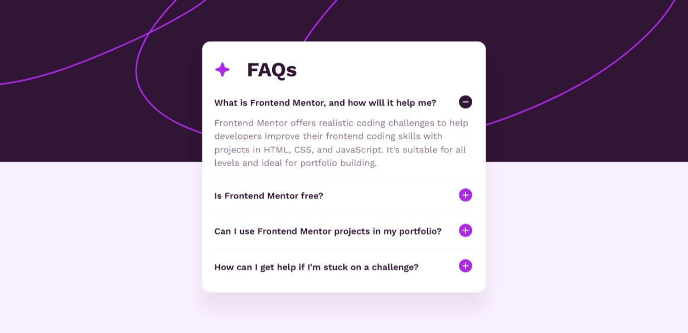

# Frontend Mentor - FAQ accordion solution

This is a solution to the [FAQ accordion challenge on Frontend Mentor](https://www.frontendmentor.io/challenges/faq-accordion-wyfFdeBwBz). This challenge helps build interactivity with JavaScript and solid layout styling with HTML/CSS.

## Table of contents

- [Overview](#overview)
  - [The challenge](#the-challenge)
  - [Screenshot](#screenshot)
  - [Links](#links)
- [My process](#my-process)
  - [Built with](#built-with)
  - [What I learned](#what-i-learned)
  - [Continued development](#continued-development)
- [Author](#author)

## Overview

### The challenge

Users should be able to:

- Hide/Show the answer to a question when the question is clicked
- Navigate the questions and hide/show answers using keyboard navigation alone
- View the optimal layout for the interface depending on their device's screen size
- See hover and focus states for all interactive elements on the page

### Screenshot

### Links

- Solution URL: [Add solution URL here](https://your-solution-url.com)
- Live Site URL: [Add live site URL here](https://your-live-site-url.com)

## My process

### Built with

- Semantic HTML5 markup
- CSS custom properties
- Flexbox
- CSS Grid
- Mobile-first workflow

### What I learned

This project helped me practice:

- Writing JavaScript logic to handle **accordion open/close toggle behavior**
- Using `.addEventListener()` for both mouse clicks and **keyboard interactions**
- Managing `aria-expanded` attributes for **better accessibility support**
- Structuring my HTML to allow **tab navigation and focus states**

### Continued development

I’d like to explore further:

- Adding smooth **CSS transitions/animations** to the accordion open/close
- Improving keyboard accessibility by supporting **arrow key navigation** between accordion items
- Exploring how to create a fully **accessible accordion component pattern** used in design systems

## Author

- Website - [Add your name here](https://www.your-site.com)
- Frontend Mentor - [@yourusername](https://www.frontendmentor.io/profile/yourusername)
- Twitter - [@yourusername](https://www.twitter.com/yourusername)
